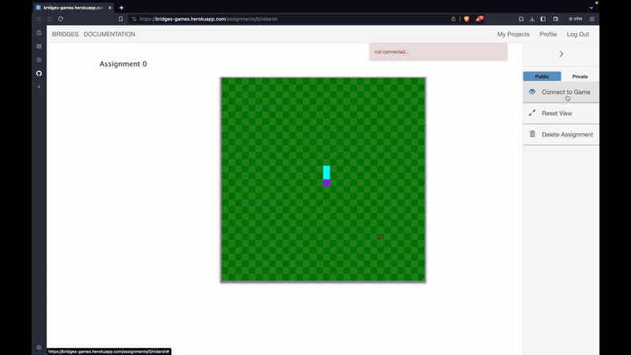

# Snake Game

The Snake Game is a classic implementation where players control a snake to navigate a 2D grid, attempting to eat randomly placed apples to grow longer. The game ends if the snake collides with itself.

## Table of Contents

- [Description](#description)
- [Features](#features)
- [Dependencies](#dependencies)
- [Game Controls](#game-controls)
- [License](#license)
- [File](./Snake.cpp)
- [Video](#video)

## Description

This project is an implementation of the classic Snake Game using the BRIDGES API for creating and visualizing the game in a 2D grid.

## Features

- Snake movement in four directions: East, West, North, and South.
- Random placement of apples for the snake to eat.
- Snake grows longer upon eating apples.
- Game over when the snake collides with itself.

## Dependencies

- [BRIDGES API](https://bridgesuncc.github.io/doc/cpp-api/2.4.0/html/index.html): A visualization tool and educational platform for teaching computer science.

## Game Controls

- **Left Arrow Key**: Move the snake to the left.
- **Right Arrow Key**: Move the snake to the right.
- **Up Arrow Key**: Move the snake upwards.
- **Down Arrow Key**: Move the snake downwards.

## Video

You can find the video file [here](./Snake_Bridges.mp4)

## License

This project is licensed under the [MIT License](LICENSE).
